# Tutorial: HTML5 Development For ASP.NET Developers Part 2, Hello Services

This tutorial will cover how to create RESTful services with ASP.NET WebAPI.  You will learn...

- How to install ASP.NET WebAPI
- How to create a service that supports CRUD operations
- How to wire up a web page to a WebAPI Service
- How to debug WebAPI Services

This module will cover how to create a RESTful service with [ASP.NET
WebAPI][2], and how to consume that service in JSON format with jQuery. There
is also a very quick primer on the concept of REST and JSON, as well as a good
look at using the [IE F12 Developer Tools][3] to debug your application.

All code used in this module can be downloaded from the course [GitHub
project][4]. Feel free to download the finished product, or follow along with
the screencast or written content.

## Screencast

<iframe width="640" height="360" src="http://www.youtube.com/embed/6RGS1ReBuPs?rel=0" frameborder="0"></iframe>

## Written Summary

In this tutorial, you will be building a sample application which displays
data from a SQL Server table using AJAX to fetch the data from a WebAPI
service. You will also add CRUD abilities to both the UI and the service while
learning how to stay RESTful with your service implementation.

### Quick Primer On REST and JSON

[REST][5] stands for Representational State Transfer. It’s a pattern for
developing services which lets the HTTP requests describe what sort of action
should be done, what format the data should be in and allows the server to
indicate success or failure using HTTP codes. Using this strategy, it is easy
to construct very predictable URL’s for web services so that consuming them
becomes much easier. There is much more to REST than that short explanation,
but this tutorial will try to stay as RESTful as possible.

[JSON][6] is an acronym that stands for JavaScript Object Notation. This is a
way of [serializing][7] data and objects into a very simple and easy to
understand string representation. This format is easily consumable not only
buy JavaScript, but is also much easier for humans to read and debug.

### Create The Sample Application

Open Visual Studio. Select **File** / **New Project** and select the **ASP.NET
Web Application** template. Name the application **HelloServices**.

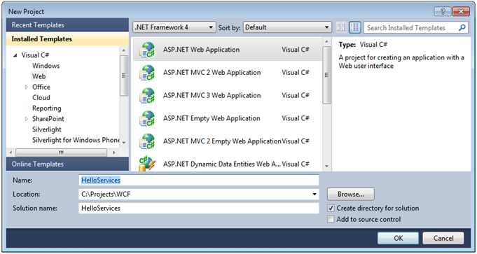

Open the **Default.aspx** page and delete all the content.

### Project Structure

Before proceeding with this project, create some structure for the application
to keep it organized. Create a folder called **Data** directly under the main
project which will hold the data access layer. Create a second folder called
**Controllers **which will hold the WebAPI service that will be created in
this tutorial.

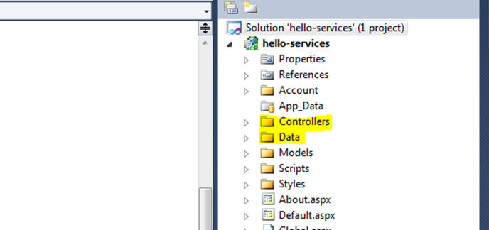

### Create A Data Access Layer

For this tutorial, the [Northwind Database][12] will be used. Additionally,
[LINQ To SQL][13] will be used as the Data Access layer given it’s simplicity
and ease of use. If you have not already installed the [**Northwind
Database**][12], you should do that before proceeding.

Right-click the **Data** folder and select **Add New Item**. When the dialogue
comes up, select a new **LINQ To SQL Classes**. Give the **.dbml** file the
name **NorthwindContext.dbml**. Click **Add**. This will bring up the **LINQ
To SQL** designer surface. Open the **Servers Explorer** window either from
the left-hand side, or from the **View** menu. Expand the **Northwind**
database and expand **Tables**. Drag the **Employees** table onto the design
surface. Save the file.

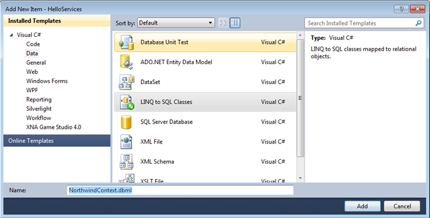

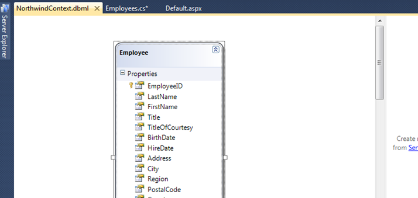

### Install NuGet Packages

**Install WebAPI**

Before the service to return the data from the database can be created, WebAPI
must be installed from [NuGet][18].

Right click the project and select **Add Library Package Reference**. When the
dialogue comes up, click the **online** tab on the left-hand side and enter
**“aspnetwebapi”** in the search box. Select **AspNetWebApi **from the search
result and click the **“install”** button. Accept the package dependencies and
install those as well.

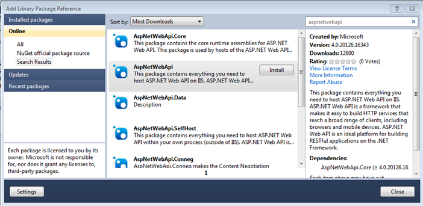

**Install jQuery**

Enter **“jquery”** in the search box. Select the **jQuery** result and select
**“install”**.

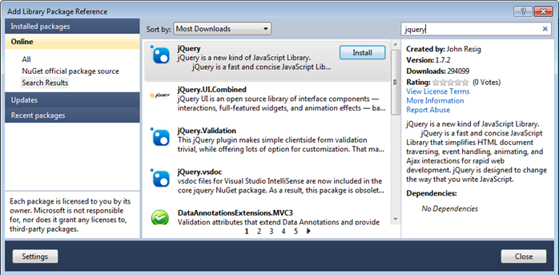

Close the **Add Library Package Reference** dialogue.

### Create WebAPI Service

In order to create the WebAPI Service, an empty class is needed. Right-click
the **Controllers **folder and select **Add** and then **Class**. Name the
class **EmployeesController.cs**.

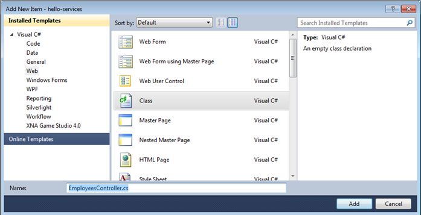

In order to designate the **EmployeesControllers.cs** class that was just
added as a WebAPI controller that will respond to requests, inherit from the
**ApiController **class. If **ApiController **is not recognized for you, hover
over the word until you get the context menu. This will give you the option to
include **System.Web.Http**. Optionally, you can achieve the same result by
click **Alt+Shift+F10**, which will bring up the same context menu.

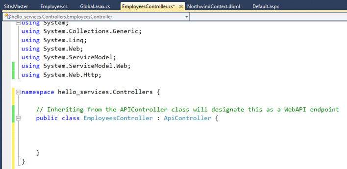

This class will contain methods that can be invoked from the web service that
is being created. This service represents the **Employees** table in the
[Northwind Database][12]. This is the table that will be used in this tutorial
for data.

A typical RESTful endpoint will respond to the following HTTP verbs:

  1. **GET** - Used when a browser is requesting data from the server

  2. **PUT** - Typically used when updating an item

  3. **POST** - Typically used when creating a new item

  4. **DELETE** - Used when deleting an item

To start with, create a get method. This method will return all of the data in
the **Employees** table in the Northwind Database. Name the method **Get()**.
The method should return a list of **Data.Employee** objects. The
**Data.Employee** object is created automatically for you by LINQ To SQL when
the **Employees** table was added to the LINQ To SQL designer surface.

Create an instance of the **Data.NorthwindDataContext** at the top of the file
and name it **_context**. This is the object that will be used to query the
database.

Inside of the **Get()** method, write a simple LINQ query to retrieve all of
the employees from the **Employees** table.

### LINQ Query To Select All Employees

    public List<Data.Employee> Get() {

        var employees = from e in _context.Employees
                        select e;

        return employees.ToList();

    }

Since WebAPI operates on convention over configuration, simply naming this
method [**Get**][27]**()** is enough to designate as the method that will
respond to an HTTP **GET**.

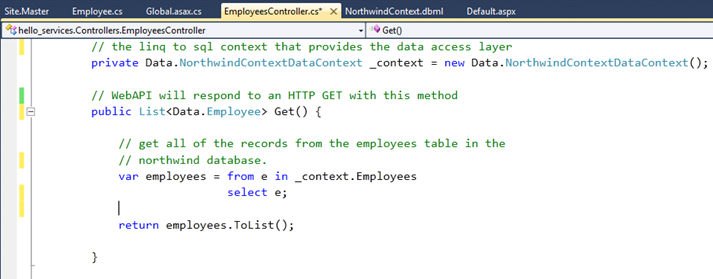

You can override this convention by specifying the verb you want a method to
respond to by decorating the method with the correct attribute (i.e.
[**HttpPut**]).

### Setup Routing

Before WebAPI can return return results via a URL, a route needs to be setup
so that the application knows to map a specific route back to the
**EmployeesController.cs** file in the **Controllers** folder.

Open the **Global.asax** file. Under the **Application_Start** method, add the
following code.

### Setup Routing For WebAPI

    void Application_Start(object sender, EventArgs e) {

        // intialize the default routing configuration

        RouteTable.Routes.MapHttpRoute(
            name: “DefaultApi”,
            routeTemplate: “api/{controller}/{id}”,
            defaults: new { id = System.Web.Http.RouteParameter.Optional });
    }

This block initializes routing for WebAPI.  This is how it knows to route
URL’s to certain controllers.  In this case, the default route says that
anything coming after **/api **on the root should be routed to a controller.
It’s also passing an optional id parameter on the end of the url.  If the id
is passed, it will be handed off to the proper method.  If nothing is passed,
it will be ignored.

This means that the route for the **EmployeesController **will be something
like [**http://localhost:3593/api/employees**][30].

### Test The Application

Press **F5** to build and run the application.  You will notice that the
application throws an error that is somewhat obscure.  If you inspect the
details of that error, it will tell you that it cannot serialize the LINQ To
SQL object.

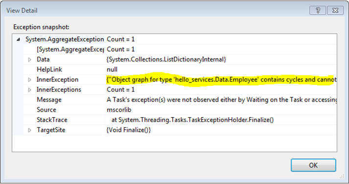

This is because .NET cannot serialize the LINQ To SQL object that is being
returned by the **Get()** method in the **EmployeesController.cs** file. LINQ
To SQL Objects are rather complex and contain far more information than what
is actually needed by the UI, which is the raw data.

### Add A Model

To get the raw data out of the LINQ To SQL objects and into a format that .NET
can easily serialize, you will create a model object which will represent one
row in the **Employees** table. This model will have properties that mirror
the columns in the **Employees** table. For the sake of brevity, you will only
add 3 properties to the model.

Right-click the project in Visual Studio and select **Add Folder**. Name this
folder **Models**. Right-click the **Models** folder and select **Add** then
**Class**. Optionally, you can achieve the same effect by pressing
**Shift+Alt+C**. Name this class **Employee**.

In the **Employee** class which is now in the **Models** folder, add three
properties. One for the employee id, first name, and last name.

### Employee Model Object

    public class Employee {

        public int Id { get; set; }

        public string FirstName { get; set; }

        public string LastName { get; set; }

    }

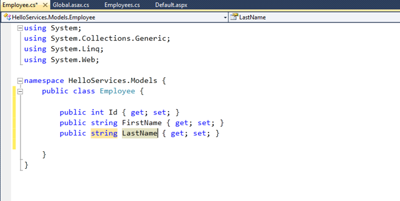

Open up the **EmployeesController.cs** file in the **Controllers** folder.
Alter the **Get()** method to return a list of **Model.Employee** objects
instead of a list of **Data.Employee** objects. Also alter the LINQ To SQL
Query so that it selects a new **Employee** model object for each row returned
from the database.

### Return A List Of Employee Model Objects

    public List<Model.Employees> Get() {

        // select a new model object for each row in the
        // linq query result

        var employees = from e in _context.Employees
                        select new Models.Employee {
                            Id = e.EmployeeID,
                            FirstName = e.FirstName,
                            LastName = e.LastName
                        };

        return employees.ToList();

    }

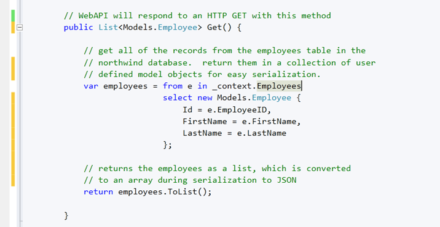

### Test The Application

Press **F5** to run the application again. Navigate to the **api/employees**
URL. Notice that WebAPI returns the records from the Northwind Employees table
in XML format.  IE will try to download the file, but other browsers such as
Chrome will display the results.

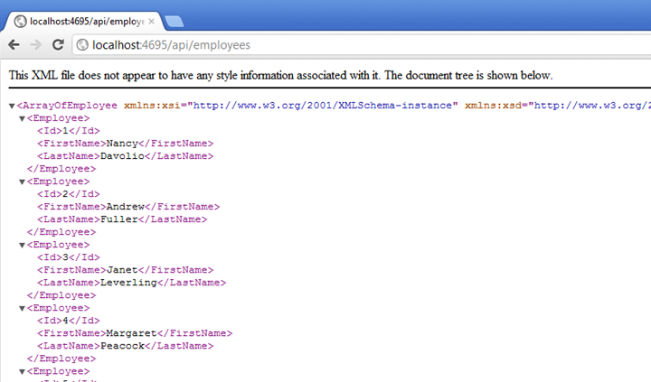

### Getting JSON Data With AJAX

Now that data is being returned by the service, it is possible to use jQuery
to call that service with [AJAX][39] and get the results in JSON format
instead of XML. Once the data has been retrieved as JSON, it is much easier to
work with it and create a user interface.

For this demonstration, you will be retrieving the list of employees and
displaying each employee in an HTML table row.

### Add jQuery To The Project

Open the **Site.Master** file and drag the **jquery.min** file over to the
page just below the **Site.css** link tag in the head of the page. At the time
of this writing, the current version of jQuery is **jquery-1.9.1.min.js**.

Open up the **Default.aspx** file. Create an HTML table element with the id
**“employees”**.

### Create An HTML Table Element

    <table id="employees"></table>

Below the **table** element that you just created, but before the closing
**content** tag, open a new script block.

### Open A New Script Block

    <table id="employees"></table>

    

Inside the **script block**, create a [jQuery Document Ready][42] function.
This is the function that executes when the entire page has loaded, including
all HTML, CSS and included JavaScript files.

Inside the **Document Read** function, select the HTML table with the id
**employees** from the [DOM][43] and assign it to a variable call
**$employees** for later use. It is considered a good practice by some to
prefix variables containing jQuery objects with a **$** so that the developer
will know that the variable represents a jQuery wrapped object when he/she
sees it later down in the code. The table is selected by it’s ID using the
[jQuery ID Selector][44] (**“#”** sign).

### Select Table When The Document Is Ready

    <table id="employees"></table>

    

### AJAX

The term [AJAX][39] is an acronym that stands for “Asynchronous JavaScript And
XML”. However, it has come to take on a much broader and less specific
meaning. AJAX generally refers to the action of making a request to the server
in the background and receiving a result. This is different from the typical
browser request/response communication in that it happens without any visual
indication that anything has taken place. It is absolutely silent unless the
UI is built to show background requests. Additionally, XML is rarely used
anymore for AJAX operations. It is most common now to use [JSON][6], which is
an incredibly simple form of serialization that is very easy to manipulate
with JavaScript. WebAPI has fantastic support for rendering JSON with the new
[System.Json][45] library.

One of the things that makes [jQuery][46] so desirable, is that it makes ajax
very trivial for a developer to implement. To make an AJAX call to the WebAPI
Employee service, use the jQuery [.ajax()][47] function. This function takes
an object that contains the parameters for configuring the AJAX request. For
the request to the **api/employees** endpoint, the configuration object will
need the **url**, **contentType**, and **success** options specified.

  * **url** - this option will be specified as the string **“api/employees”**.
This URL is a relative path, so there is no need to specify the full url.

  * **contentType** - since it is much easier to work with JSON, the ajax
request needs to specify that the data should be in JSON format. This is done
by setting the HTTP Header content type to “application/json”. When using
jQuery, this is done simply by setting **contentType** to “json”

  * **success** - this is the function that will be called when the server
returns a response to the ajax call. The function takes in a data parameter,
which will hold the JSON response returned from the employees web service.

### Make An AJAX Call For The Employees Data In JSON Format

    <table id="employees"></table>

    

In order to put the data returned into the page, it will be necessary to
iterate over the results returned by the server. This is done using the jQuery
[.each()][48] function. As each item is iterated over, a new row is added to
the **employees** HTML table by using the [jQuery append()][49] method. The
table variable is used instead of selecting the table each time in the loop.
Selecting an item once from the DOM and referencing it in a variable is better
for performance and cuts down on code clutter.

### Make An AJAX Call For The Employees Data In JSON Format

    <table id="employees"></table>

    

### Test The Application

Press **F5** to run the application, or if your app is still running, simply
save the file and refresh the page or point the page at the **Default.aspx**
url. Since all the changes were made in JavaScript, it’s not necessary to stop
and start the application.

Notice that the application shows the employees in a list. Press **F12** to
open the developer tools. Click on the network tab and click the **“Start
Capturing”** button. Refresh the page. Notice the request that is made to
**api/employees**. Double-click on the request. Notice that the **Content-
Type** is set to **JSON**.

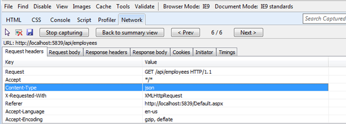

Select the **Response body** tab. Inspect the JSON response returned from the
server.

### Enable Deleting Of Employees

Switch back to Visual Studio and the **Default.aspx** page. In order to add
the ability to delete employees from the UI, its necessary to add a button out
to the right-hand side of each row. This could be done by adding more HTML
inside the **.each()** loop. However, this is already a bit messy. There is
HTML in the JavaScript and adding to this would make it worse. Its generally
best practice not to include HTML inside the JavaScript this way.

### Templating

In order to clean this up and make it better, its a good idea to use a concept
called **templating**. This is simply the idea of having a single table row
which is created once and then copied for each element in the dataset and
appended to the table. There are many forms of templating and some libraries
that make this much simpler. This will be explored in more detail in later
modules.

For this example, a very rudimentary form of manual templating will be
demonstrated. The idea here is to add a block of HTML that is invisible on the
page, but can be used to dynamically create HTML elements. Specifically for
this example, a table row is needed. This implementation involves adding a div
with an id of **templates** right after the closing **script block**. The
style on this div will be set to **display: none**. This means that this div
and all its content will not be displayed on the page. Inside of this div,
create a table. Create a single table row definition with a column for first
name, a column for the last name, and a column for the delete button that
contains a button. These elements will have classes and not id’s since they
will be used over and over again.

### Create A Block Of Template HTML

    <table id="employees"></table>

    

    

        <table>

            <tr class="row-template">
                <td class="firstName" style="width: 100px;"></td>
                <td class="lastName" style="width: 100px;"></td>
                <td>
                    <input type="button" value="X" class="delete" />
                </td>
            </tr>

        </table>

    

Inside of the **each()** loop, select the **templates** div by its id. Then
use the [**jQuery .find()**][54] method to select the row by it’s class. This
will find the item(s) in the children of the **templates** div with the
specified selector. Once the table row is selected, call the [**jQuery
clone()**][55] method. This will create a new object of the same type that was
just selected (a table row), and store it in the variable.

This is called **“Chaining”** in jQuery. This is when methods are called on
methods because each method returns an object, allowing the developer to
continue to call methods on the same line. Once the row template has been
created, find the first and last name columns and set their [.html()][56] with
the first and last name from the returned JSON data. Then select the button by
it’s class and add a click event.

Inside of the click event, create another **ajax()** method. The URL will be
the same as the first **ajax()** method with the exception that the current
item id is appended onto the end. This creates a RESTful URL. The **type
**should be set to delete. In the **success** function, simply remove the item
from the page by calling the [**jQuery .remove()**][57] function. This will
reflect the database change in the UI.

Lastly, right before the closing bracket for the **each()** loop, append the
row to the table.

### Create A Block Of Template HTML

    <table id="employees"></table>

    

    

        <table>

            <tr class="row-template">
                <td class="firstName" style="width: 100px;"></td>
                <td class="lastName" style="width: 100px;"></td>
                <td>
                    <input type="button" value="X" class="delete" />
                </td>
            </tr>

        </table>

    

### Run The Application

Press **F5** to run the application. Open the Developer Tools in IE by
pressing **F12**. Switch to the network tab and click **Start Capturing**.
Notice that when the **delete** button is clicked, an AJAX request is fired to
the server with a method of **DELETE**. The server is currently returning a
404, because the **DELETE** method has not yet been created in the service.

## Add A Delete Method To The Employees Service

Switch back to Visual Studio and stop the application. Open up the
**EmployeesController.cs** file in the **Controllers **folder. Create a void
method underneath the **Get()** method called **Delete()** which takes in an
**id** parameter of type **int.**

### Create A Delete Method

    public void Delete(int id) {

        // code to delete employee by id goes here

    }

Inside of the **Delete()** method, select the employee to delete by it’s id
from the LINQ to SQL context. Delete the employee and submit the changes using
LINQ To SQL.  The id parameter is passed along by the default routing that was
setup in the **Global.asax**.  Since the method is named **Delete()**, it will
respond to an HTTP **DELETE** verb.

### Delete The Employee With LINQ To SQL

    public void Delete(int id) {

        // select the employee from the database by its id
        var employeeToDelete = (from e in _context.Employees
                                where e.EmployeeID == id
                                select e).FirstOrDefault();

        // delete the employee from the context
        _context.Employees.DeleteOnSubmit(employeeToDelete);

        // submit the changes
        _context.SubmitChanges();

    }

Add yourself as an employee in the Northwind **Employees** table by providing
just your last and first name. The other employees cannot be deleted due to
existing relationships in other tables.

### Run The Application

Press **F5** to run the application. Press **F12** to open the Developer
Tools. Switch to the **Network** tab and click **Start Capturing**. Click on
the delete button next to the name you added to the database. Notice that the
**delete** AJAX request happens and a **200** is returned from the server.
This means that everything has happened OK and the item has been deleted from
the database. Also notice that your name was removed from the page by jQuery.

### Further Reading / Resources

**WebAPI** is a maturing library and is baked into the next official release
of MVC 4. For now, the following screencasts should help you become quite
familiar with using WebAPI in MVC 4.

[WebAPI With MVC 4 Screencast Series][62]

The completed application used in this project is available on the course
[GitHub site][4].

![][63]

   [1]: http://www.kendoui.com/blogs/teamblog/posts/12-05-02/html5_development_for_asp_net_developers.aspx

   [2]: http://www.asp.net/web-api

   [3]: http://msdn.microsoft.com/en-us/library/dd565622(v=vs.85

   [4]: https://github.com/telerik/html5-dev-for-aspnet-devs

   [5]: http://en.wikipedia.org/wiki/Representational_state_transfer(Representational state transfer - Wikipedia, the free encyclopedia)

   [6]: http://www.json.org/ (JSON)

   [7]: http://en.wikipedia.org/wiki/Serialization (Serialization - Wikipedia,the free encyclopedia)

   [12]: http://www.microsoft.com/en-us/download/details.aspx?id=23654(Download: NorthWind and pubs Sample Databases for SQL Server 2000 - Microsoft Download Center -Download Details)

   [13]: http://msdn.microsoft.com/en-us/library/bb425822.aspx (LINQ to SQL:.NET Language-Integrated Query for Relational Data)

   [18]: http://nuget.org/ (NuGet Gallery)

   [27]: http://www.w3.org/Protocols/rfc2616/rfc2616-sec9.html

   [30]: http://localhost:3593/api/employees

   [39]: http://en.wikipedia.org/wiki/Ajax_(programming

   [42]: http://api.jquery.com/ready/ (.ready() – jQuery API)

   [43]: http://en.wikipedia.org/wiki/Document_Object_Model (Document ObjectModel - Wikipedia, the free encyclopedia)

   [44]: http://api.jquery.com/id-selector/ (ID Selector (“#id”) – jQuery API)

   [45]: http://msdn.microsoft.com/en-us/library/system.json(v=vs.95

   [46]: http://jquery.com/

   [47]: http://api.jquery.com/jQuery.ajax/ (jQuery.ajax() – jQuery API)

   [48]: http://api.jquery.com/each/ (.each() – jQuery API)

   [49]: http://api.jquery.com/append/ (.append() – jQuery API)

   [54]: http://api.jquery.com/find/ (.find() – jQuery API)

   [55]: http://api.jquery.com/clone/ (.clone() – jQuery API)

   [56]: http://api.jquery.com/html/ (.html() – jQuery API)

   [57]: http://api.jquery.com/remove/ (.remove() – jQuery API)

   [62]: http://weblogs.asp.net/jgalloway/archive/2012/03/16/asp-net-web-api-screencast-series-with-downloadable-sample-code-part-1.aspx (ASP.NET Web API -Screencast series with downloadable sample code - Part 1 - Jon Galloway)

