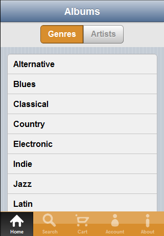

# Tutorial: Kendo Mobile Music Store: Genres View

The genres view is a simple list of the available Genres. The HTML for the view is a single &lt;ul&gt; element that is used as a ListView widget.

    

        <ul data-role="listview" data-bind="source: genres" data-template="genre-list-template", data-style="inset"></ul>
    

This view uses MVVM bindings against a view model, specified by the attribute `data-model="app.genresView.viewModel"`.
This view model consists only of the genres data.

    viewModel: kendo.observable({
        genres: data.genresList
    })

The result demonstrates the basic usage of the ListView widget bound to a DataSource that retreives all the data from an OData web service.
Each genre is rendered into the ListView from the `genre-list-template` template:

        

Each genre is an anchor tag that will navigate to the `albums-view` and demonstrates some parameter passing.
In this case we are passing `field` `operator` and `value` parameters to the albums-view that will later be used as a DataSource filter to narrow the results to only this genre.
